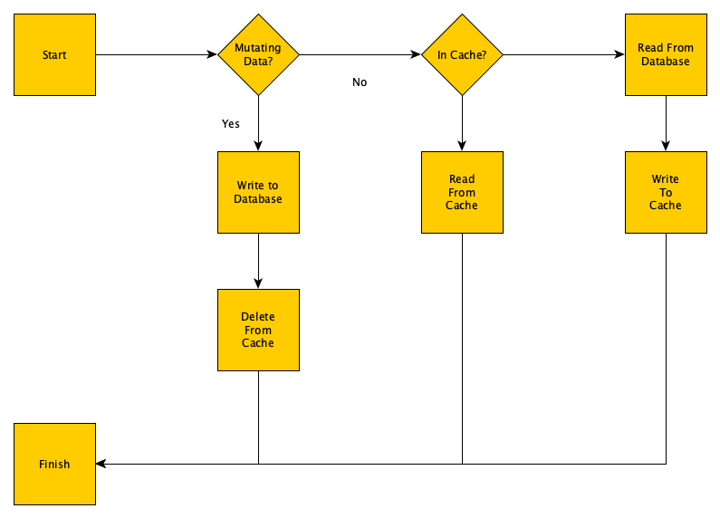

# go-blog-cache (github.com/antonio-alexander/go-cache)

Full disclosure, I'm writing this in hindsight; I, fortunately or unfortunately, have already made a lot of mistakes with caching, so _We_ don't have to do the work of learning the wrong thing. My initial experience with caching came from my microcontroller/controls background; which coincidentally is __identical__ to the normal use case for caching (more on this later). So the goal of this repository is to describe the general mechanism behind caching and to show an implementation in Go as well as some examples in the wild that I've used in [go-bludgeon](github.com/antonio-alexander/go-bludgeon).

After reviewing this repository, you should:

- be able to describe a cache in general terms
- be able to talk about edge cases of caches and situations specific to timeseries and employee data (as described in this repository)
- be able to identify the differences between a memory-based cache and a cache implemented in redis
- understand how scaling (with multiple clients or multiple instances of a given service) affects the efficacy of caching
- understand how to validate if a cache is effective

## Bibliography

Here are some links that should be helpful and got me a lot of answers in this process:

- [https://medium.com/@cocm1324/implementing-cache-with-go-71e29fcdaf7](https://medium.com/@cocm1324/implementing-cache-with-go-71e29fcdaf7): this is good for showing how to implement a cache in Go (basics) and does a good job of describing cache eviction strategies
- [https://github.com/antonio-alexander/go-stash](https://github.com/antonio-alexander/go-stash): this is an example of a general purpose (possibly over-engineered) caching solution
- [http://github.com/antonio-alexander/sql-blog-indexing](http://github.com/antonio-alexander/sql-blog-indexing): further down, I mention that sometimes you can get the benefits of "redis" by optimizing your database and/or queries; this blog post goes through that effort and shows some practical examples/applications
- [https://www.geeksforgeeks.org/computer-organization-architecture/types-of-cache-misses/](https://www.geeksforgeeks.org/computer-organization-architecture/types-of-cache-misses/): this describes some kinds of cache misses
- [https://redis.io/glossary/cache-miss/](https://redis.io/glossary/cache-miss/):

## Getting Started

In general, the [Makefile](./Makefile); should do most of the heavy lifting for you. This repository contains the source code to provide the following functionality:

- a service with an implementation of a cache that reads employees from a populated database using the test_db from [github.com/datacharmer/test_db](github.com/datacharmer/test_db)
- a client with an implementation of cache that communicates with the service, this will be containerized and available to install (via go install)
- a mysql database
- a containerized instance of redis (used for the cache)

To load the test_db into an empty mysql database:

```sh
docker exec -it mysql /bin/ash
cd /tmp/test_db
mysql -U mysql -p < employees.sql
mysql -U root -p $MYSQL_PASSWORD
> GRANT ALL ON employees.* TO 'mysql'@'%';
```

Alternatively, if the database is up and running and you've pulled the git modules, you could execute the following:

```sh
make mysql-employees
```

To troubleshoot the database, you can use the following command:

```sh
docker exec -it mysql mysql -u mysql -p
```

To troubleshoot redis, you can use the following command:

```sh
docker exec -it redis redis-cli
```

There [should] be several tests present in this repository, please browse at your leisure.

> Context: I could be lazy and decide not to do the tests, this is me putting the energy out there to complete this project with reasonable testing

## The Concept of Cache

Cache at its most basic, is a tool you can use to reduce the time to retrieve certain data; this has a _potential_ side-effect of increasing performance. Although a cache is generally added with the idea that it will increase performance, it isn't a one-size-fits-all solution, but to understand why it isn't, you must understand how it works.

I think a cache is best described from the perspective of microcontrollers because performance is easier to quantify. A processor/microcontroller, cache and RAM are VERY similar to an application, a cache, and a database. For a microcontroller, it needs to periodically access data, which is stored in cache, RAM or another [slower] storage source. Cache is faster than RAM and RAM is faster than slower storage (it's less the technology and more how close the storage mechanism is to the controller). Certain kinds of cache are _physically_ located on the processor, while RAM is located further away on the motherboard and may use some other (slower) bus.

Caching, as a function of performance, works by optimizing for hits. A "hit" is when you ask the cache for data and the data is there, a miss is when it isn't there (either because it wasn't added or was removed prematurely). If there are more hits than misses, the result can be a perceived increase in performance. If there are more misses than hits, then the result is a perceived decrease in performance.

If you stop there, you'd probably think...why don't we just put everything in cache and then if we get more hits than misses, we'll be as performant as possible, but that's not necessarily true. Cache (on a microprocessor) is expensive and is significantly more limited. These caches are generally an order of magnitude less than RAM; cache is generally megabytes while RAM would be gigabytes. So... because you can't store everything on the cache, you must shift data around from the cache to the ram (or to slower storage) to optimize for hits. This "algorithm" must intelligently move data between RAM and the cache to increase the ratio of hits to misses.

And here-in lies the rub, the hardest part about caches are not the caches themselves, but the algorithm/strategy to use to evict and shift data. Ask yourself these kinds of questions:

- how do you know what data you need to cache?
- how do you know when you should no longer cache data?
- how do you know if you're caching the right data to optimize misses?
- how do you remove or shift data from the cache once the cache is full?

## Maxims: Simple Truths for Complex Implementations

Caches are personal, they are like artwork; you could compare developing a cache to drawing a face, you know that two eyes, a nose and a mouth are the things that help identify a face as a face, but beyond that there is infinite variation that makes each face unique (or less functional: e.g. a deviated septum). Here are some maxims I've thought of while doing this repository that may help summarize the basic ideas presented in one place:

- cache should be closest to where you want the perceived performance increase

> a cache is a sort of perspective, where you place it will "inform" that cache; generally, placing it closer to where you want that perceived performance increase will make it more likely

- memory based caches should only be used when there's a single instance of a service

> when interacting with multiple instances of a given service, if you implement a memory-based cache, each instance will have a different _perspective_ on what to cache; this assumes that you have some kind of load balancer in front of it and that each instance doesn't process the same request

- caches are personal, they're not democratic or for sharing in most cases

> a cache should be personal and as specific as possible, sharing a cache between two entities that don't have the same goals is a recipe for disaster, at best the cache will be less performant, at worse it could perform worse than if you simply hit the database directly

- caching is difficult for write heavy objects

> there's a cycle time associated with caching, you can think of caching as starting a car from a dead stop, to get it rolling you need a lot of force, but to maintain speed you need significantly less additional effort. When you have write heavy objects and your cache has to reflect those changes, the cycle time associated with not only sensing that the change has occurred but replacing the data in the cache may not be performant

- sometimes it’s better to optimize the database than to implement a cache

> I can't stress this enough; caching should be implemented in sitautions where you've determined that you can't further optimize something; if you're worried about implementing a cache but having optimized (or created) indexes for tables in the database to see if you can increase performance than you've failed in due diligence

- don't develop a cache without validation

> Unlike most software development where verification is the most important thing (does it work the way I designed it); the impetus to develop a cache should be based off of a hypothesis (e.g., if I add a cache, I can reduce round trip time by 50%), if you have no baseline or no metrics you can use to validate whether the cache was successful, you're doing it wrong

- natural and surrogate keys used as search criteria can be safely cached

> A key or a combination of keys that are immutable are safe to use as keys for caching and this is doubly true for caching keys for search criteria

## How to Design a Cache

A cache must be designed around a scenario; a cache only works if you can design an algorithm that is right more often than its wrong. Caches are __easy__ to implement, but difficult to design for this reason. To design a cache, you must answer a number of questions about the data you're attempting to cache; scenarios _exist_ where the efficacy of a cache is so minimal it could be practically non-functional or _reduce_ performance. Here are some questions (with explanations) that can help this design process:

How often is the data you want to cache mutated?

> This is specific to changes to the data that occur externally; cached data that's mutated often means that even though you have a "hit" in the cache, the cache becomes out of date and needs to be evicted (or refreshed). By the time the cache is refreshed, the data itself may change meaning that even though the cache _could_ increase performance, it's increased for __stale__ data

How often does the data change (this is more attached to phenomena), rather than mutated?

> If the data changes often, say you have a dashboard that provides current values at 1Hz, then your cache needs to overcome the cycle time, your cache must update _FASTER_ than 1Hz in order to serve a non-stale cache; a cache that's supposed to serve current values serving stale values is a failed cache

Is it possible to stabilize the resources of the cache?

> I think this is easy to miss; solutions like redis are optimized such that you can avoid worrying that you're going to use too many resources, but generally once a cache has been in service for a reasonable period of time, the resource usage of the cache should be stable, if there's an increase in memory or CPU usage that grows in proportion to the data, or goes up and down, it means that your algorithm isn't stable and at any given time the cache could fail (or be less performant) which could have ramifications to consumers of the cache

What is the life cycle of the data being cached?

> How is your data born, how does it live and how does it die? These kinds of questions are just as important for cache as they are for a database schema. Understanding the life cycle provides insight into how viable a cache can be. For example, if data is short lived, your cache may always be empty or filled with data in need of eviction

Is it possible to create a key for your cached data?

> This can be a small oversight to any caching solution, it may seem obvious when I say this, but to retrieve cached data, you have to be able to re-create the key you use to store it. Yes, you may have a very simple implementation that only has one endpoint and the key you use to store is _always_ available, but more often than not, you have to generate a cache for a set of endpoints interacting with the same data, but in different ways

A cache is similar to developing an application: you must understand the failure modes, how you expect your application to respond to certain stimuli (verification) and have an idea of how to know your application is solving the problem you set out to solve (validation). A cache's goal is to have a hit to miss ratio that creates a perceived increase in performance.

## How Does a Cache Work?



A "fully functional" cache involves two asynchronous, but interconnected processes. One is used to move data into the cache as it's being actively read, while the other is removing (or evicting) data from the cache such that it will result in a miss (e.g., the algorithm has determined it is no longer necessary to serve that data).

> Fully functional" indicates that there is a version of a cache that isn't. The two processes described above aren't necessary to be functional. You can implement only the read portion of the cache or a very simplistic eviction strategy and be successful

The most well-known part of the cache is the part that attempts to read from the cache. When someone attempts to access an endpoint that reads data, the following should occur:

  1. attempt to create a key describing the data that could be cached
  2. check the cache to see if the data is present, if so, return the data (hit)
  3. if the data is not present (miss), check the source (e.g., the database) for the data
  4. if data is returned from the source, store the data in the cache using the key created in step 1 (subsequent API calls for the same data should be able to skip steps 3 and 4)
  5. return data to caller of API

Keep in mind that a miss (where data is not present in the cache) can happen for a variety of reasons, not just because the cache doesn't include the data, but also maybe because the cache is unavailable, or times out or simply fails. This failover is __very__ important as you could still provide the expected functionality (even if there's a chance you'll be less performant).

The __expected__ failure mode for a cache is that it will _always_ failover to the source if the cache is unavailable or a miss occurs.

## Cache Invalidation

The lesser known (and arguably more important) process of caching is how data in the cache is periodically pruned. There are a few reasons why you should prune your cache, a short list is below:

- data in cache may be old; as there is no direct feedback (more on this later) between the database and the cache, the versions could be different given enough time
- at scale, the performance of the cache could be inversely proportional to the amount of data in the cache; this is generally true at scale. If you were to think of an in-memory cache, eventually you'd have to worry about memory fragmentation and the costs associated with that

Cache invalidation is one of the more difficult things to design and implement in a cache; but the reason isn't because it's hard to do, but because it's hard to know _when_ to remove it. Removing cached data too early would create an artificial miss such that the performance could be decreased while allowing cached data to be stale could mean that you return incorrect data or the overall performance of the cache decreases because there's too much data. The issue with cache invalidation can be summed up with the following questions:

- How do you know when the data is stale?
- How do you know when the data is wrong?
- How do you know when data has been mutated?
- How do you know when data has been removed?

These questions are not impossible to answer, but they're personal, the answers will change depending on the data; that was the intention of the questions in the [How to Design a Cache](#how-to-design-a-cache) section: to create a personality for your data. In practice, caches implement eviction/invalidation that pre-supposes that you have no feedback (more on this later). Some common cache invalidation solutions are (not an exhaustive list):

- least recently used: this removes items from the cache that have been used recently
- least frequently used: this removes items that aren't used frequently
- first in, first out: this removes the oldest items first

All the above algorithms either assume a fixed limit to the number of items that can be stored in the cache (without it, the logic can be open ended/pointless) or have an assumption about how often data must be used to be reasonably cached. The algorithms __only__ depend on information present in the cache (e.g., information about how often data is pulled in the cache and how old the data is).

An adjacent (and equally important) issue is about how to create keys for cached data. Caches are also known as key value stores and to read or write to a cache, you have to provide a key. Even though there are different endpoints that return the same data, not all endpoints have access to the same data and as a result, their ability to create keys is also limited by contract of each endpoint.

For example, let’s say you can read an employee using its employee id or its email address, in the request, the only information you'll have available is the employee id OR the email address, never both; so if you design your cache properly, you'll need to be able to look up the data from an employee using the key of an email address or the key of the employee id. This obviously takes up more space, a solution would be to have a table of employee data keyed by employee id and another table of employee ids indexed by employee email addresses. Sure, it's two "hops", but you don't duplicate data.

Finally, invalidation can also be done with active feedback. Generally, a cache becomes invalid once the referenced object has been mutated: meaning it's been updated or deleted (i.e. no longer exists). This kind of feedback can be built into the backend/source of truth: when an object is mutated that operation does a one-way update of the cache (or at least signals such information to the cache).

> I'll also note that the basics of this kind of feedback can be implemented without the additional complexity: if your delete function is idempotent (i.e., not a soft delete); you can automatically invalidate caching of these specific objects. In addition, not all cached data can be deleted (e.g. historical timeseries, yes it can literally be deleted, but generally for the lifetime of the cache, it won't be), so there's certainly a limit

Active feedback would work like this:

1. user creates an object
2. user reads an object; that object is cached
3. user reads the object again; the cache returns the object (cache hit)
4. user modifies said object
5. backend notifies cache that the object has been updated
6. separate process invalidates the object in cache
7. user attempts to read the object again (cache miss); updated object is cached
8. user deletes the object
9. backend notifies the cache that the object has been deleted
10. separate process invalidates the object in cache
11. user attempts to read object (cache miss); use receives error that the object cannot be found

Keep in mind that this solution doesn't solve the issue between steps where the cache can be queried and return invalid data; it simply mitigates the issue to as close to zero as possible (the RTT of the request from the backend to invalidation of the cache).

> Note that adding active feedback also increases the complexity of the solution and couples the service itself to the caching solution (which has pros and cons); reducing the time for the feedback loop could inadvertently reduce the hit-to-miss ratio of the cache

I've done an implementation of this kind of feedback with the Changes service in the [go-bludgeon](github.com/antonio-alexander/go-bludgeon) project which focuses on notification of a "change" and making it available rather than actually interacting with the cache directly. This is a general purpose solution rather than a solution specific to caching.

## How to Verify a Cache

This section is intentionally short, not because verification is easy, but because the design section and its questions will show you how to verify its functionality and this section is an extension of that. The most important part about verification of the cache is considering its failure modes around (1) the result of cache misses and (2) what happens if the cache is unavailable?

> Note that I talk about verification and validation separately; although this is the basis for a much larger conversation (verification vs validation); the short answer is that verification is tied to functionality: does it do what I expected/designed it to do while validation is tied to efficacy: does it fulfill the reason I created it for, and does it do it well enough?

Verifying a cache is not unlike testing an application, you must control the variables enough to create a hit or miss situation. The environment/scenario can be configured one or two ways:

1. You can store/reset the state of the cache by clearing the cache and replacing it with a known state
2. You can perform the steps to prime the cache

Simple tests should simply confirm hit or miss scenarios; you can ramp up the complexity or focus of the tests by integrating things like:

- timing: use this to verify pruning operations; if you read a cached value after a certain point, is it invalid? or maybe are you reading an older version of the object?
- concurrency: use this to verify global interactions; most applications assume that more than one person will be using an application at the same time, use these kinds of tests to verify that each user's experience of the cache is similar enough

I think the sky is the limit, but your focus is going to be verifying miss and hit scenarios and ensuring that cache invalidation is working within the defined parameters. Working through verification of the cache is also a good opportunity to understand how you'd debug said cache in production (please add debug logs).

## How to Validate a Cache

Once you've successfully developed a cache and you have __verified__ that it works, the next step is to validate the functionality by quantifying its efficacy. Like any kind of test to validate a situation, you initially must come up with some metrics (or goals); you have to determine a level of efficacy that makes the effort of developing a cache worth it.

I'll do the work of making some strong assumptions; in practice you'll have to do the work yourself to figure out what makes the most sense coupled with the limitations of your cache you've found when you did the initial [design](#how-to-design-a-cache):

- on a cache hit, the round-trip time (RTT) for reading an object should be reduced by the difference in the time it takes to get a response from cache vs the service
- on a cache miss, the object read should be immediately committed to cache; subsequent reads (for a period) should result in a cache hit
- when searching for identical criteria, the objects read AND the search criteria should be committed to cache; subsequent searches (for a period) should result in a cache hit

To confirm the above, you need to know the following:

- the average RTT for a cache hit
- the average RTT for a cache miss
- the average RTT when cache is disabled/unavailable

With the above numbers and applying it to different environments you can establish a baseline of performance; validate as to whether you've reached the performance expected (e.g., is it 50% faster if the object is cached) and you have a valid starting point to make changes to understand how a specific change moved the needle closer to or further from your goal.

> Validation should be the starting point for how you determine future feature development. These kinds of metrics give you boundaries to prevent unnecessary over-engineering: if there's no specific reason to implement a feature, why do it? Validation helps you define a thesis (to validate) and focuses your effort: if I change x, I think it'll cause y and if it doesn't cause y, I can do a and check again

There's a conversation about edge cases; for example, using the employees resource API as an example, what if you assume that there won't be a lot of churn/mutations for employees, but in practice you find that there is. You _COULD_ do the effort to validate this use case early on, but without any data you're guessing at best. It's better to true up a simple scenario initially and then compare it to what happens in practice. It's better to have the tools to answer the question, "Why isn't my hit/miss ratio greater than or equal to what I expect" than to say "I think this edge case will perform this way, so I'll do it". The latter is half of a conversation and could be a waste of time.

## How to Determine Where to Place a Cache

Once you design a cache and you determine its efficacy, you may find that it's not what's expected or functional enough; another lever you can pull (so to speak) is the placement of the cache. Placement of the cache can have a proportional effect on its efficacy. Although not a hard and fast rule, you can think of the following as rules of thumb for cache placement:

- the closer the cache is to the source of truth, the greater the number of objects that will be cached; this could mean that the cache uses more resources than expected or that you have object churn because data is constantly being pruned which increases eviction (and reduces the hit/miss ratio)
- the further the cache is from the source of truth the more likely it is to contain data that matters to the consumer of the API
- in environments where you may have multiple instances of a given service, you can't use a memory cache, but memory caches are incredibly useful when placed client-side in these cases (clients can be seen as single instances if they aren't multiple instances of the same "consumer")
- the further the cache is from the source of truth, the less likely you are to be able to have feedback for cache invalidation
- there's no rule that says you can't have more than one cache; multiple caches may increase complexity, but give you the tools to increase efficacy

Have you ever thought about caches for streaming services? Remember two things that I've said so far: (1) caches are personal and (2) you can only generate keys for caching from what's in the request itself. Let's say that you're building a cache for Netflix, and you realize that a specific region REALLY likes a specific movie. While you could cache it in your centralized servers where you have the fastest connections and more resources, because it only affects a given region, it'd make more sense to push that cache to be in a regional server; not only because it'll be one less hop for the people in that region, but because this would __only__ be useful for people in that region.

## Cache Data Consistency

Along with the difficulty of cache invalidation comes varying degrees of data consistency. A cache that returns inconsistent data, depending on the content/context, could be non-functional or worse, flakey. Data consistency, especially for a cache, exists on a spectrum of how bad it is if your cache is wrong (in addition to ways in which it _could_ be wrong).

Remember the question I raised earlier regarding how often your data changes/is mutated; each time the data changes or is mutated, there's an opportunity for the cache to be wrong. Even _with_ [cache invalidation](#cache-invalidation), the cache can be __wrong__ in the time between the data changing and the cache being invalidated; depending on the data, the result of an invalid cache can be catastrophic or merely an inconvenience:

- if the [employee](./internal/data/employee.go) were to be cached and is wrong, the properties that could be wrong are: (1) birth date, (2) first name, (3) last name and (4) gender; the employee number won't change post create and its unlikely that the hire data would change post create. So possibly, if used for a report (or an email) it's possible that the name would be incorrect. Or specifically, the risk is low; mutations don't happen very often, so the risk is low for data inconsistency
- if there's timeseries data and you're caching last known (or current) values; as time changes, the cached values become incorrect; eventually the data will be correct (as you can invalidate current values at the rate at which you query new values). But generally, incorrect values simply mean that the display of the values are incorrect. Hypothetically, you could say if someone is using those cached values to generate derived values at a _time_ not connected to the historical data; they could create historically incorrect derived data; but that's easy to resolve
- let’s say that you run timers, and those timers are used to determine someone's pay; let’s say for some reason you're caching that data for display purposes, but someone uses it to calculate how much money to pay someone and it's wrong; in that case, the outcome of data inconsistency is very negative (and high)

Not to sound like a recording, but your mileage may vary and doing the homework of understanding how your data will be consumed and its lifestyle will help you understand if it's safe to cache or not.

## Cache Scenarios

Below, we'll go through a number of scenarios to try to point out situations where some of the idiosyncrasies that drive some of the design situations and to explain the idea of what makes a _cache_ personal: It's data. Below we'll go through three scenarios:

1. Resource API
2. Timeseries API
3. Live Concurrent Edits

### Cache Scenario 1: Resource API

I think resource APIs are the most common candidate for caches, the application of a cache to a resource service/API is easy to explain, both for implementation and for validation (with a few gotchas). In this case, an API exists which allows you to read employees; employee data doesn't change often, but different clients (connected concurrently to the service) may interact with a reasonably fixed number of employees (this is the example coded).

Using the [design](#how-to-design-a-cache) mentioned above, here are some of the answers to those questions:

How often is the data you want to cache mutated?

> This requires some heavy domain knowledge, but I think it's safe to assume that employee data isn't mutated often, think of how often an employee changes their last name (when they get married/divorced) or how often an employee's salary changes (maybe once a year). So, in terms of mutation of employee data, the short answer is: not often

How often does the data change (this is more attached to phenomena), rather than mutated?

> In this case, the data changing is 100% event driven; something "else" causes this data to change, such as a life event or getting a raise and in those cases, those events don't happen often; they're periodic; in some cases, they may even adhere to a schedule (i.e., the company always gives raises at the same time every year)

Is it possible to stabalize the resources of the cache?

> In this case, I think the answer would be yes, because the distribution of necessary caching of employees should be relatively narrow given the infrequent nature of changes, the only time where caching would be unstable would be the one time a year everyone's salary is updated (in this case, because every user is being modified, the cache should be incredibly unstable)

What is the life cycle of the data being cached?

> Employees are hired, promoted and fired, A fired employee can probably be removed from the system after a period of time and if they can't, that employee (at least) will no longer be mutated

Is it possible to create a key for your cached data?

> Yes, the API allows you to read users using their email address, their employee number or searching with specified criteria (first name, last name, gender, email address and employee number). We can create a key using the employee number and lookup using email address. In addition, we can create a checksum for the search criteria and cache the results; this has some data consistency gotchas, but otherwise, its practical to create a key for cached data

This scenario focuses on reading employees from a database; unlike a complete implementation, there are no additional endpoints to mutate employees. There are two endpoints that are available:

- /employees/<&nbsp;employee_no&nbsp;>: can be used to find an employee by using their employee number
- /employees/search: is used to provide a search criteria to find zero or more employees

At a basic level, we must store employees in cache keyed by the employee number. Although it's obvious if we take a look at the database schema, we _know_ that employee numbers are unique among all employees, so using employee number as a key should allow us to easily look up employees in the cache. In "Go" the data would be architected as a map:

```go
type memoryCache struct {
 sync.RWMutex
 employees map[int64]*data.Employee //map[emp_no]employee
}
```

Although generating keys for looking up employees using their employee number is simple, doing so for searching is more complex. Keeping in mind the uniqueness of a key for caching to successfully cache search __results__ you have to create a unique key for searching. There are "two" tricks to enable caching of search results:

- you can create a unique key by converting the search criteria into a JSON string and then doing an MD5 hashing of the resulting string (giving us a practically unique string via checksum)
- we can "store" the results by returning an array (or map) of the returned employee numbers

This solution would look like the following:

```go
type memoryCache struct {
 sync.RWMutex
 employees map[int64]*data.Employee      //map[emp_no]employee
 searches  map[string]map[int64]struct{} //map[search][emp_no]
}
```

This is the contract for search results:

```go
type EmployeeSearch struct {
 EmpNos     []int64  `json:"emp_nos"`
 FirstNames []string `json:"first_names"`
 LastNames  []string `json:"last_names"`
 Gender     string   `json:"gender"`
}
```

If you determine that the search is cached, you can then get the employee numbers returned in the search and return them. Although this requires two hops/lookups, you can only store one copy of the employee in the cache versus two copies. Even though this solution "works" it has issues with data consistency: over time, as more employees are added, those search results can become incorrect, for example:

- what if an employee with the same first name as another employee is added AFTER caching the search results?
- what if an employee gets a name change AFTER caching the search results?
- what if your API allows you to search for "nothing", but return everything; how could you cache those results and maintain data consistency?

In comparison, if you have search criteria with only employee numbers, you'll find that the result is 100% consistent, there can never be any overlapping employee numbers so the search results will NEVER be different, but ONLY if the criteria only has employee numbers, otherwise its less consistent. A rule of thumb (also in the [maxims](#maxims-simple-truths-for-complex-implementations) section is that criteria based on natural keys are always consistent).

> It's possible to build logic around these known failure modes around data consistency; for example, you could forgo caching (or reading) of search criteria where there are values in first/last names and gender, or maybe you could have a much shorter timeout for those search criteria to mitigate data inconsistency

Eviction/Pruning in the absence of mutation in feedback, although not impossible generally requires a _longer_ time interval where data will be inconsistent as you'll be dependent on static time intervals where data is evicted.

### Cache Scenario 2: Timeseries API

A server exists which provides an API to read timeseries data; there is an expectation of concurrent clients, and these clients will have the opportunity to read the "same" current or last known values; practically this kind of service could be used to monitor a physical asset's running hours and health. Using the [design](#how-to-design-a-cache) mentioned above, here are some of the answers to those questions:

How often is the data you want to cache mutated?

> This is more complicated for timeseries data as it can be three kinds of timeseries data: current, last known and historical. On _top_ of timeseries data being 100% dependent on the data/phenomena itself, endpoints that return timeseries data from different perspectives is "mutated" differently and as a result the data may be mutated often and at differing rates

How often does the data change (this is more attached to phenomena), rather than mutated?

> Conceptually, timeseries data doesn't change but current and last known values do change, once. When the current value or the last value is updated, the data changes. Another way to say it is that the "data" associated with a "key" for a current value or a last known value will update

Is it possible to stabilize the resources of the cache?

> This 100% depends on how much data you cache; the answer isn't necessarily yes or no, but can you maintain functionality of the cache while stablizing the resources is the real answer. If you have to invalidate the cache too often to stabilize it you may not be able to serve cached results often enough for it to be functional

What is the life cycle of the data being cached?

> Timeseries data practically lives forever (historically); last known values live until new values update while current values become invalidated at the rate at which you serve current values (e.g. 1hz should invalidate data every second)

Is it possible to create a key for your cached data?

> Yes, generally for current and last known values you only need some way to address/uniquely identify the tag you want data for. For _historical_ data, you'll need to convert the time into something unique. Alternatively, if you have additional configuration options (e.g., interpolation, decimation, averaging, min/max) you may need to include them in your cache key if it changes the data returned

Timeseries data generally has a composite key where you have a unique identifier for the data/phenomena and a timestamp; if these two items are used and the timestamp is exact, you should get a single value back. In addition to these, you generally read timeseries data in the context of (1) current values, (2) last known values and (3) historical values:

- current: these values have to do with "now", current values update at the rate the phenomena updates/mutates; it's possible for there to be "no" current value
- last known: these values have to do with the _last_ time the phenomena was updated/mutated; it's only possible for there to be "no" last known value when no value has ever been generated
- historical: these values have to do with values that have been recorded (from any time before to "now"); historical time is highly variable as your at the mercy of what the user requires. In addition, this is difficult to cache without being informed by certain business logic (e.g., there's an algorithm that uses the last known days of historical data or something like that)

Use of time as a key can be complicated; there are a couple of gotchas related to the formatting of the timestamp itself, the resolution of the time itself and a required logic around comparison of time (e.g., is 1:10 greater than 1:10:01). While simple in practice, keys generally being limited to strings makes this even more complicated in that to "search" for historical data in the cache you must pull a subset of the data in order to determine if what you're searching for is present in the cache.

> The resolution of time can be subtly complex, not just from a formatting perspective, but from a data consistency perspective. Incorrectly considering resolution can give you weird off-by-one issues with data consistency where you don't always return the same number of data points. This can __also__ affect configuration that allows you to down sample or interpolate data; these manipulate date in a way that can hurt the cache because it's "faster" to perform interpolation or down sample in the database and as a result, it's dangerous to cache because it's __different__ from the non-down sampled/interpolated data

Cycle time is very important when it comes to caching current values. If the time it takes to evict and update cached data for a current value is greater than the rate of change of the current value, you either _can't_ cache current values for that data OR you have to build in some known assumptions about the data, something like even though the data changes at sub 1Hz, current value through a given endpoint will only return current value updated at 1Hz. Alternatively, you could create a calculated value that provides a consistent value for current value but is not _actually_ a current value.

The business logic for how current/last known values will be used can help make a more focused (and consistent) caching solution for timeseries data. For example, what if there's a dashboard that always displays current value for a given phenomenon; you could "cache" that data such that you could reduce the number of "reads" from the database to populate n dashboards to 1 rather than n. This business logic is unique, because it's not easily something you can implement in aggregate (i.e., for every phenomenon). Conversely, this is unique because you _know_ the data is going to be read, but in a lot of cases you don't know the data will be read and even using those "reads" as a trigger, you may still cache data that's not read often (this is wasted cache).

In addition, concurrency adds another layer of complexity, especially for current value data. If you have 10 clients that read current values and you trigger caching the data on read; it's possible that they could "all" ask for data at the same time and none of them, be able to take advantage of the cache because when they "check" the cache for data, it's a "miss". This is why the previous logic _preempts_, to mitigate this possibility. This can also be affected by the cycle time of eviction/updating; if the cycle time is too slow you may _always_ be refreshing data and never able to take advantage of the cached data.

> Alternatively, you could "synchronize" the data such that the others will wait for the cache to occur, but this could adversely affect performance; what if the cycle time was 1s, but data is updating at 1Hz, in this case, the cache would be too old before it would be set

Like any cache, there's a technological and practical limit to how much data you can (or want) to store in a cache. Because this is timeseries data rather than scalar object data you're more likely to push the size limits. This is compounded by the nature of the data itself, 1Hz data vs 10Hz data is an order of magnitude difference in storage space. Additionally, most timeseries API almost always allows you to get data from more than one tag, so the cache must be able to aggregate data from multiple tags for the same time range.

## How to Solve Problems Created (or Exacerbated) By a Cache

<!-- REVIEW: you mention store of record here, it's not for the first time, but it's the first time you call it that, maybe review the rest of the document and use that term more often? -->

Caches are generally meant to solve the loading it places on the store of record; reading from redis (or memory) is generally faster than reading from the database and (within reason) scales better and/or is less expensive (either in complexity or actual cost). Unfortunately, implementing a cache creates it's own class of problems that may invalidate the performance benefit you're trying to get. Like most applications, problems occur during failure/failover and on certain edge cases around min/max modes (e.g., unexpected cache misses).

<!-- TODO: add picture showing the period of attempting to read from the cache, maybe? -->

It's easy to forget that at some point, your cache will be empty and un-initialized; that it won't contain any data that would be used by it's consumers (e.g. a cache hit). By design, when a cache miss occurs, data must be read from the store of record, in the event you have a high ratio of cache misses to cache hits, you _could_ overload the store of record or at least subject it to the load you're trying to prevent. When a cache is un-initialized, it will always result in a cache miss where upon your logic for loading the cache should initialize the cache.

> Yes, you could pre-initialzie the cache, but this assumes that you know what to initialize it with; keeping in the spirit of only putting data in the cache that someone is interested in, it may not be reasonable to guess or copy the entire store of record into your cache

This situation where the cache is empty can be exacerbated if you have a lot of concurrent consumers asking for data that can't be in the cache. Eventually, the cache will be initialized and emit a cache hit, but in the short term, all of those concurrent calls will failover to the store of record. This can happen when the store is empty, but also if an object (or group of objects) have been invalidated in the cache.

Let's say, that you have 10 concurrent consumers reading the same data and you only load data in the cache that has been read (this makes this situation a bit more practical). In order to get data into the cache, you have to have a cache miss, then successfully read the data from the store of record and THEN store it in the cache. If those 10 concurrent consumers attempting to read the same data, all experience a cache miss, then they will failover to the store of record and then update the cache (possibly with the exact same data). This wastes CPU/memory and can create a cpu/memory spike both for the cache (read/write cycle) AND for the database.

This is called a cache stampede or thundering herd problem. One way to solve this problem is to introduce a delay/retry into the cache read; maybe you should read (miss) and then try again after waiting for a period of time. This works, but introduces a mandatory delay (i.e., it doesn't fail fast). And this will occur __every__ time there's a cache miss which isn't ideal: you sacrifice user experience to protect the store of record.

> This isn't to say that the database or store of record is somehow so fragile that it can't survive this situation, just that this is something you can reasonably mitigate.

A better solution is to serialize those initial writes with logic (like one-shot mode on a [555 timer](https://en.wikipedia.org/wiki/555_timer_IC)); for the first consumer that encounters the cache miss, you atomically set a flag that the missed value is being read and then when other consumers encounter the miss, they see that it's being read, so they delay and retry a set number of times (before failing over to the store of record). Although complex, this introduces latency only in the situation where you have a cache miss and another consumer is already attempting to load the cache.

This is something that _definitely_ matters at scale, but could also occur in sitautions where there's heavy mutation of data that multiple consumers are interested in (or some faulty search that creates the same _key_).

See the output of this test without the one-shot logic:

<!-- TODO: add output of the test with the logic disabled -->

See the output of this test with the one-shot logic:

<!-- TODO: add output of the test with the logic enabled -->

This can be implemented at scale using the cache itself and will introduce initial latency when a cache miss occurs; if there's no heavy concurrent usage, there's no latency, but if there is, then latency is introduced; this is tactical and under most situations, won't hurt the user experience.

Another issue/problem is the cache handling the concept of zero or 'no data'. Using the failover logic, if the data doesn't exist, you'll always get a cache miss and then you'll hit the database and it won't be in the record of store. So (by design) for data that doesn't exist, you'll always incur the maximum load. If _everyone_ were to try to read data that didn't exist...you would incur the maximum load on both your cache and the record of store. So in situations where that miss is practical and expected; you can cache that "miss" such that the cache returns a response that you can communicate and avoid hitting the store of record.

For example, lets say I want to search for employees with the first name 'Frank', but no employees exist with that name. If I continue to perform that search, it'll always result in a miss such that i'll check the cache and the store: it'll completely bypass my caching logic. If this is something that happens often enough, you can resolve it, by caching this miss and returning it as a hit. It _still_ needs to be invalidated, possibly timer-based, but this way the cache can stabalize and you're not polling the store for something that doesn't exist (yet).

<!-- TODO: cache miss by there being no data or concept of zero, talk about how it's difficult to represent "no data"; talk about situations where data is deleted and doesn't exist to place in the cache, so will always cause a database hit; talk about how to cache that a search (specifically) can result in empty data-->

## Frequently Asked Questions

What are the advantages of placing a cache server-side? client-side? intermediary?

> Placing a cache server-side give you more flexibility for logging and you can take advantage of more resources, while placing a cache client-side may have a much higher hit ratio but may be harder to troubleshoot or have far more limited resources. Placing a cache somewhere between the client/server-side could be useful for situations where you have clients in common regions, and you use some level of load balancing etc.

Is it likely that where you place the cache, similar data will be read?

> Caches are a kind of centralized repository of related data; caches are __PERSONAL__, meaning that they are deeply tied to the object(s) themselves and should be closest to the perspective you want to have increased performance. What if (arbitrarily), client 1 often reads A and B, client 2 often reads C and D and the cache itself is limited to only two objects. If the cache is located on the server, then there's a maximum 50% that clients 1 and 2 will have a perceived increase performance, but if the cache is located near the client, there's a 100% chance that each client will have a perceived increase in performance

Are in-memory caches not a practical solution?

> These are practical; I think localized in-memory caches can be tactically placed in specific locations. In-memory caches are the same as client-side caching; they are the "most personal" in that you can cache information that specific to the client. Client-side implementation of in-memory caches can have an incredibly high-level of efficacy since you can eliminate the RTT associated with poor performance. This is not unlike lazy loading

What happens when you add specific (non-cache) business logic to a cache?

> This is dangerous for the same reason microservices can be dangerous. Business logic sprawl, de-centralization of monolithic architectures/ideas and a difference in release cadence make it dangerous (in my opinion) to combine cache and business logic. It's not that it’s impossible to do, or that there aren't benefits to such a thing, but coupling business logic and cache can come with a lot of long-term technical debt: what if the business logic changes, would it exacerbate downstream client-side issues? How quickly could you get it updated? These kinds of things have to be taken into account; it’s a good rule of thumb to minimize client-side failure modes and keeping the cache simple helps

Why might it be difficult to create a consistent key for cached data?

> Creating a key for caching is limited by what's available at the time of the request. Yes, it's possible to have access to "more" data (e.g., pre-population of a subset of the database), but if you don't have enough information in your request to make a key that's unique to the data returned for a given piece of time, it may be impossible. For example, querying historical timeseries data can be difficult to consistently create a key for; to create a consistent key, you'd need to know the time range, the specific channels/tags you wanted and the specific configuration of the returned data. This situation isn't ideal for creating keys because it's likely that you'd have a pretty decent spread of keys, so you'd have more misses on average than hits (assuming that there's not an emergent pattern for consumption of historical timeseries data by your clients)

In the memory cache, why do you create a map of pointers to employee?

> This is an elegant _hack_ to simplify the job of the garbage collector; it does two things: reduces the memory footprint of the map and allows you to lookup employees by employee number w/o iteration. Maps and arrays are relatively dangerous long-term because they don't place nice with memory fragmentation; because they can grow semi-infinitely, when it has to grow beyond its memory allocation, the memory manager has to find a new contiguous piece of memory. A map of pointers will take significantly less space since only the memory associated with the size of the address (and the map) needs to be re-allocated

In the memory cache, why do you copy the pointer of the employee?

> This is something you'd only notice if you had an in-memory cache being used in the same application namespace; if you don't copy the pointer (specifically the data in the pointer), there's a possibility that you could modify the data in the cache by modifying it somewhere else in the code where you pass the pointer. If it's not obvious, if two objects reference the same address, modifying one modifies the other; this is a type of memory leak

How do you handle a situation where you want to cache results from a search criterion?

> Caching search results is difficult (even if it's just a subset of the result of the search): in terms of defining a key around the specific search criteria, caching the actual results as well as ensuring data consistency. What happens if you cache the search results for employees and you _only_ searched by first name and an employee is added with the same first name the search results are cached?

Can you resolve issues with data consistency when generating derived data from cached data?

> In general, you can't resolve these kinds of issues, but you can mitigate them by sensing the inconsistency, invalidating the cache and/or updating the derived data. This isn't always possible and is highly dependent on the data. But two simple examples are current values and last known values. With current value you can mitigate this issue by invalidating the cache when the current value has expired (e.g., if it updates once a minute, invalidate it once a minute or once you have a new current value); for last known value, you can do the same, once the last known value has changed, invalidate that cached value

How can you confirm data consistency around more complicated read functions like searching?

> This is highly dependent on the search criteria; some search criteria are fixed such that a given search criteria will 100% always return the same results no matter what. Using employees as an example, if you search for a list of employee numbers, you can safely cache those results (it is possible for the search criteria to be consistent, but the employees to be old). For results that aren't consistent (i.e., not natural or surrogate keys), this simply isn't possible: there's no way to maintain data consistency for data that is not consistent

How should you handle cache errors?

> Errors in the cache should never be passed to the client but should be visible and exposed to logging for debug purposes. Because caching occurs at a "hidden" layer it’s important to have _some_ ability to debug it and/or know what's going on. For example, even if your cache logic automatically failover to the source of truth, if the experience just gets slow and it's not obvious the cache is failing (or getting more misses than expected); it’s MUCH harder to troubleshoot

How can scaling from the perspective of clients and services affect the design of a cache?

> Multiple clients, especially multiple clients asking for data that has yet to be synced, can tax a cache significantly or invalidate an assumption. Although I do go over this elsewhere, you may think of the eviction and subsequent setting of the cache to be a serial or concurrent operation, but it's parallel, there's no guarantee that multiple clients won't attempt to get data that's not in the cache at the same time. Additionally, when you have a load balanacer or multiple instances of a given service, a memory cache is no longer effective (as each instance would have a different version of the cache)

How can load balancers, multiple instances of a service (or cache) affect the design of a cache?

> Load balancers can add a level of complexity depending on where the cache is located; redis makes a lot of this conversation moot, but desires to localize cache could push you to use the same redis instance but different databases for redis. Distributed databases make it harder to perform global invalidation of objects through feedback or knowing that an object was deleted

What kind of logging would be useful for a cache?

> I think there's a lot of value in localized logging, knowing what operation is occurring in the background such as when an object has been invalidated (and why) or knowing if a request has been served from cache or from the source of truth. In addition being able to turn this logging on when needed versus always been on (or being able to view it retroactively) are also very valuable because caches are _very_ opaque

Is interacting with a cache fundamentally the same as interacting with a database?

> Yes, but only at the surface. Functionally they are the same in that you read and write data, but where they differ is in their failure modes. Their _use cases_ (i.e. needs) are fundamentally different; caching is not meant to be the source of truth, so it doesn't require things like auditing, transactions and access control. These things maintain and prioritize data consistency and by extension can reduce performance and make databases an unpopular choice for caching

What if it takes the same amount of time to read from a cache than to read from a database?

> This is a possibility. Practically it means that you probably won't get enough benefit from the cache to go through the trouble of implementing it. For a cache to be useful, at a minimum, it must be faster to read from it than the source of truth. You could argue that it might scale better (e.g., scale cheaper); but you'd have to validate this

Can a cache help me optimize for concurrency (not just performance)?

> Kind of; I think the context of this question is that optimizing for performance is one thing, but if you have a high level of concurrency (think thousands of simultaneous users); even if you have subperb performance, the limitation becomes how many users you can serve simultaneously without a reduction in [perceived] performance. Databases in terms of concurrency, scale with the numnber of connections which is _fixed_; there is some magic
you can do with tools like [pgbouncer](https://www.pgbouncer.org/) and you can also scale the number of replicas (I want to say this is a bit more complicated for mutations). A cache may scale differently in terms of concurrency and may use those connections for a shorter period of time so ther'es a possibility that caches (like redis) can scale cheaper and with less complexity than a database

Shouldn't we just cache objects as we mutate them?

> No, although its safe to assume that there may be an implicit read-back when you mutate an object, this read-back doesn't benefit from a cached value AND there's no guarantee that it'll be read again. Additionally, its possible that it's mutated again before it's cached and as a result, there would be no benefit to storing that version of the object in the cache. Its always best to populate the cache with things that are actively being read

Is there a way we can totally prevent the cache from being wrong between the time between mutating an object in the db and removing it from the cache?

> It's possible, but this is an example of trying to mitigate an implicit race condition. There's no way you can guarantee that no-one is trying to read the cached object when you are modifying it. And that's not me saying that you can't use a mutex, you could, but that would defeat the purpose of the cache since it would serialize all of your operations and totally eliminate the ability for concurrent queries

Since the client and server could share the same redis instance, wouldn't it be more efficient to have the client use the cache directly?

> Yes, totally possible, but not without drawbacks. Elsewhere in this document, I've mentioned things about cache placement. Although it effectively reduces the number of hops to 1 and if data is in the cache it could _potentially_ have the best performance it comes with a handful of drawbacks: (1) shared cache on the client would mean that the cache would hold significantly more data that is less localized, (2) it's more likely for the cache to be incorrect since you could read faster and (3) you have to expose your redis instance to clients and this could increase the attack surface area

How do you cache data that doesn't exist?

> This certainly has some context, but if your cache logic doesn't recognize the concept of zero or 'not present', you can have some issues with cache normalization. If the data doesn't exist in the cache, it may "always" result in a cache miss and cause an unnecessary database hit (undoing the reduction in load you implemented the cache first)

Are there ways to mitigate the stampeding herd problem without the complexity (and footprint) of complex one-shot logic?

> Yes, although there may be something specific to your implementation that may make this not work; in general, if you can handle data being stale for a period of time and a __full__ read from your store of record, you can simply evict all of the data in the cache and replace it. You __must__ do this with logic not triggered by external endpoints (to avoid the stampeding herd problem). Implementing eviction logic __will not__ solve the stampeding herd problem, it will exacerbate it since it's possible for multiple consumers to ask for the missing data at the same time
